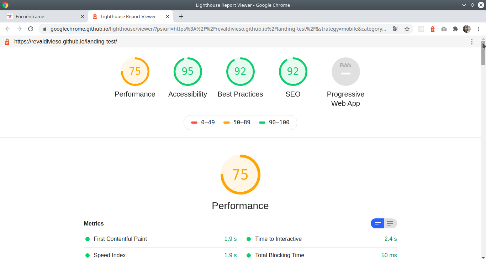

## Descripción del proyecto 💻

[Encuéntrame](https://revaldivieso.github.io/landing-test/), es una aplicacion web diseñada para que el usuario pueda conocer a tu próxima cita, al escoger el género de su preferencia.

## Definición de Usuario 👥

Ésta app, está orientada a cualquier persona que desee conseguir pareja.

## Tecnologías Utilizadas 👾

- [Javascript](https://developer.mozilla.org/es/docs/Web/JavaScript).

- [HTML](https://developer.mozilla.org/es/docs/Web/HTML).

- [CSS](https://developer.mozilla.org/es/docs/Web/CSS).

- [Git](https://git-scm.com/).

- [Bootstrap](https://getbootstrap.com).

## Evaluación con Lighthouse

#### Tiempo de desarrollo

24 horas.

## Developers

- [Vianny Reyes - Front-end dev](https://github.com/revaldivieso)
